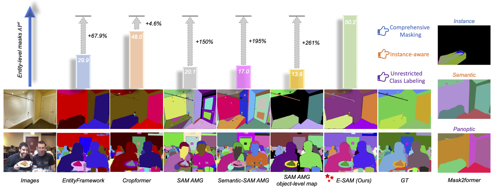

<div align="center">
<h1>E-SAM</h1>

[**Weiming Zhang**](https://scholar.google.com/citations?hl=zh-CN&user=cdtgqkgAAAAJ)<sup>1</sup> · [**Dingwen Xiao**](https://scholar.google.com/citations?hl=zh-CN&user=Zd-5kV4AAAAJ)<sup>1</sup> · [**Lei Chen**](https://scholar.google.com/citations?hl=zh-CN&user=gtglwgYAAAAJ)<sup>1,2</sup> · [**Lin WANG**](https://scholar.google.com/citations?user=SReb2csAAAAJ&hl=zh-CN)<sup>3&dagger;</sup> 

<sup>1</sup>AI Thrust, HKUST (GZ)&emsp;<sup>2</sup>HKUST&emsp;<sup>3</sup>NTU
<br>

<a href="https://arxiv.org/abs/2503.12094"></a>
<a href='https://weimingz996.github.io/E-SAM/'></a>
<a href='https://arxiv.org/abs/2503.12094'></a>
</div>

We propose E-SAM, a novel <b>training-free framework</b> that exhibits exceptional Entity Segmentation capability. It mitigates the over-segmentation and under-segmentation challenges inherent in AMG by integrating Multi-level Mask Generation (MMG), Entity-level Mask Refinement (EMR), and Under-Segmentation Refinement (USR).



## Acknowledgement

We sincerely thank ...

## Citation
If our work inspires your research or some part of the codes are useful for your work, please cite our paper:
```bibtex
@article{zhang2025sam,
  title={E-SAM: Training-Free Segment Every Entity Model},
  author={Zhang, Weiming and Xiao, Dingwen and Chen, Lei and Wang, Lin},
  journal={arXiv preprint arXiv:2503.12094},
  year={2025}
}
```

